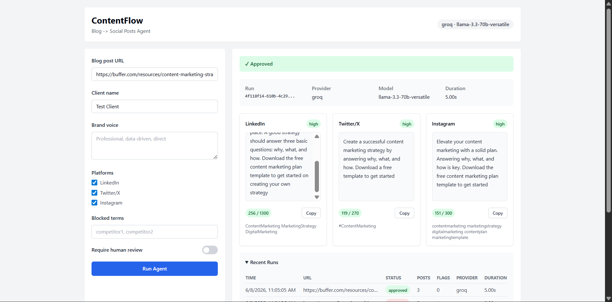
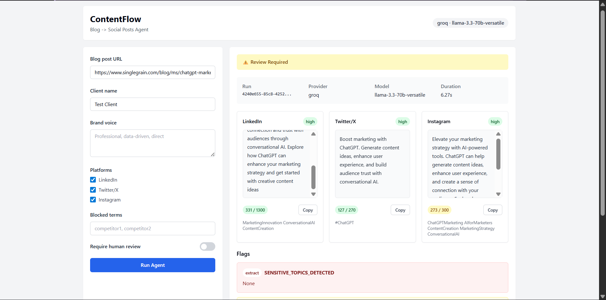
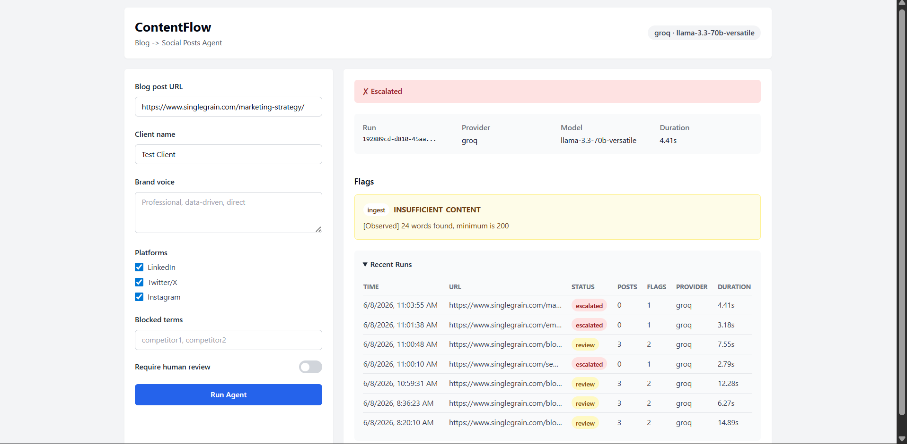
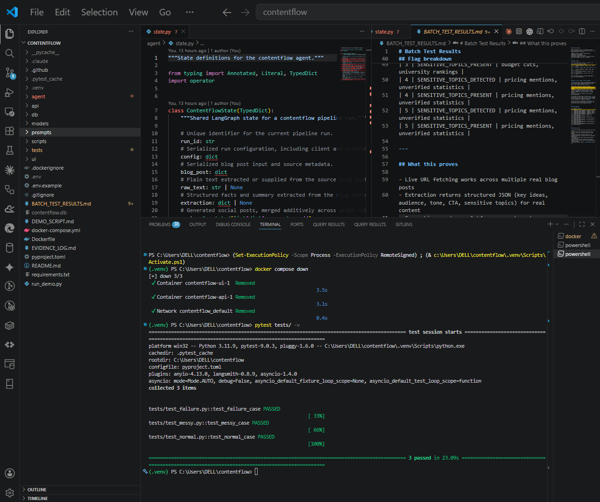

# ContentFlow

A LangGraph agent that takes a blog post URL and generates platform-specific social media posts for LinkedIn, Twitter/X, and Instagram — with deterministic validation, human-in-the-loop review, and full routing logic.

Built for the Single Grain Beat Claude Intern 011 challenge.

Built with: LangGraph · Groq (llama-3.3-70b) · FastAPI · Tailwind CSS · Docker

---

## Screenshots

**Approved** — clean post, 0 flags, auto-published



**Review Required** — competitor names detected, routed to human inspection



**Escalated** — insufficient content (JS-rendered page, 24 words)



**Tests** — 3/3 passing



---

## How it works

A blog URL enters a 5-node LangGraph pipeline:

1. **Ingest** — fetches the URL, strips nav/footer/scripts, counts words. Under 200 words or 404 → escalates immediately.
2. **Extract** — LLM returns structured JSON: key ideas, audience, tone, CTA, sensitive topics, confidence.
3. **Generate** — one LLM call per platform, run concurrently via `asyncio.gather`. Twitter auto-retries if over 270 chars.
4. **Validate** — Python regex checks for blocked terms, unverified stat phrases, first-person voice. No LLM involved.
5. **Route** — hard failures → escalated. Soft flags → review (LangGraph `interrupt_before` checkpoint). Clean → approved.

---

## Quickstart

```bash
cp .env.example .env
# add GROQ_API_KEY to .env (free at console.groq.com)
docker compose up --build
# open http://localhost:3000
```

Or run locally:

```bash
python -m venv .venv && .venv\Scripts\activate
pip install -r requirements.txt
python run_demo.py
```

---

## Switching LLM providers

Change one line in `.env` — no code changes needed:

```env
LLM_PROVIDER=groq        # default (free)
LLM_PROVIDER=anthropic   # claude-sonnet-4-20250514
LLM_PROVIDER=openai      # gpt-4o
LLM_PROVIDER=gemini      # gemini-2.0-flash
LLM_PROVIDER=ollama      # local, no key needed
```

---

## Evidence

- `tests/fixtures/output_normal.json` — approved run, 3 posts, 0 flags
- `tests/fixtures/output_messy.json` — escalated, INSUFFICIENT_CONTENT
- `tests/fixtures/output_failure.json` — review, sensitive topics flagged
- `BATCH_TEST_RESULTS.md` — 5 real Single Grain URLs, live pipeline execution
- `tests/fixtures/bad_output_log.md` — real failure caught during development + fix documented
